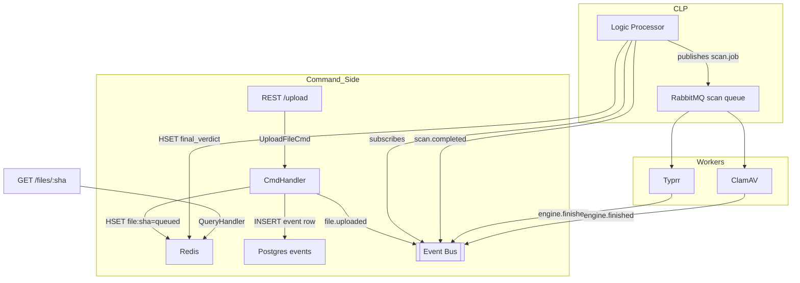

# 🛡️ **Skanii** v1.0.0 – tiny, wicked-fast malware-scanning pipeline  
*Mini-VirusTotal built with Node.js + TypeScript, RabbitMQ, **Redis-first**, Postgres event-log, and a Central Logic Processor.*

[](…)  
[](LICENSE)  
[](docker-compose.yml)

---

## ✨ Why Skanii?

* **< 2 s p95 latency** on a laptop  
* 🔒 User-ns sandbox per engine (`noexec`)  
* 📜 Immutable **event log** in Postgres (audit, replay)  
* 🧠 **Central Logic Processor (CLP)** – orchestrates engines, fuses results, emits a single `scan.completed` verdict  
* 🚀 CQRS-lite skeleton – every future dashboard/ML module is just another projection  
* 🪄 Planned “Magic” upgrades: drag-drop instant verdict, GPT explanations, auto-scale

---

## 📦 What ships in v1.0.0

| Layer | Capability | Engines / Services |
|-------|------------|--------------------|
| Ingress | REST & CLI upload (≤ 100 MB) | — |
| Core   | SHA-256 dedup · Redis hash store · Command → Event flow | — |
| **Logic** | **Central Logic Processor** (subscribe → fan-out → aggregate) | CLP |
| Workers | **Typrr** (file-type) → **ClamAV** (AV) | Typrr · ClamAV |
| Results | `GET /files/:sha256` JSON view (final & per-engine verdicts) | — |
| Ops | Docker stack · Prometheus metrics · Grafana dashboard | — |
| Security | API-key auth · token-bucket rate-limit (Redis) | — |

Everything else (YARA, web UI, ML clustering, auto-scale) lives in **`ROADMAP.md`**.

---

## 🚀 10-minute quick-start

```bash
git clone https://github.com/your-org/skanii.git
cd skanii
docker compose up -d                # web, clp, workers, redis, postgres, rabbitmq, grafana
# wait ≈3 min for ClamAV sigs
curl -F "file=@/path/eicar.com" -H "X-API-Key: YOUR_KEY" http://localhost:3000/upload
curl http://localhost:3000/files/SHA256
````

Power users: `pnpm i && pnpm dev` runs the gateway; start CLP + workers with `pnpm clp` / `pnpm worker`.

---

## 🗺️ High-level architecture



*Reads are **always** from Redis; every state change is appended to the immutable `events` table; CLP assembles the final verdict once all engines report.*

---

## 🏗️ Project structure

```
/apps
  api/            – NestJS gateway (REST)
  clp/            – Central Logic Processor (orchestration FSM)
/packages
  core/
    commands/     – CQRS command handlers
    events/       – Event definitions & publisher
    fsm/          – FileScan finite-state machine
  engines/
    typrr/        – Wrapper & Dockerfile
    clamav/       – Wrapper & Dockerfile
docker/           – Service images & configs
docs/             – Diagrams & ADRs
```

---

## 🧪 CI / CD

* **GitHub Actions**: lint → unit tests → Docker build → Clam sig fetch
* Nightly job bumps ClamAV signatures via PR
* Build ≤ 5 min, fails merge on red
* SBOM & image signing targeted for v1.1

---

## 🛣️ Roadmap (abridged)

| Version | Focus                            | Candidate “Magic”                 |
| ------- | -------------------------------- | --------------------------------- |
| v1.1    | YARA engine · Web UI             | Drag-drop ⇢ instant verdict agent |
| v1.2    | Helm chart · auto-scale          | GPT-powered plain-English verdict |
| v1.3    | Global SHA cache · ML clustering | Cross-file campaign grouping      |

Full backlog lives in **`ROADMAP.md`**.

---

## 🤝 Contributing

1. Fork → feature branch (`feat/xyz`)
2. `pnpm lint && pnpm test` must pass
3. Submit PR; maintainers review event-schema compatibility
4. CI publishes edge Docker images on merge

By contributing you agree to the [Contributor License Agreement](CLA.md).

---

## 📜 License

Apache 2.0 for Skanii code.
ClamAV runs in its own GPLv2 container; communication via stdout/exit-code keeps Skanii Apache-clean.

> **Fast, auditable, hackable.** Clone, spin up, and start scanning—Skanii + CLP does the rest.
